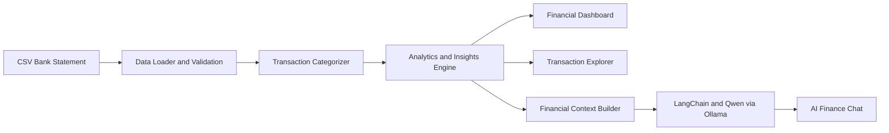

# 💰 Finance AI Assistant


A local-first personal finance analytics application that processes bank-statement CSV files, categorizes transactions, generates interactive dashboards, and answers natural-language questions about spending using LangChain and a locally hosted Qwen model through Ollama.


---

## Overview

Finance AI Assistant transforms transaction data into understandable financial summaries and interactive visualizations.

The application provides three main capabilities:

1. **Financial analytics** — calculates income, expenses, savings, savings rate, category totals, and monthly trends.
2. **Transaction exploration** — allows users to search, filter, review, and export transaction records.
3. **AI-powered analysis** — answers natural-language questions using financial context derived from the uploaded dataset.

The dashboard and transaction-analysis features work without an LLM. The AI-chat feature requires Ollama and the `qwen2.5:3b` model to run locally.

---

## Key Features

- Upload bank-statement CSV files
- Validate and process transaction data
- Automatically categorize transactions
- Calculate total income, expenses, and net savings
- Calculate monthly savings rates
- Visualize spending by category
- Compare monthly income and expenses
- Identify the largest spending category
- Identify the highest-spending month
- Search and filter transaction history
- Export filtered transactions
- Ask natural-language questions about the uploaded data
- Run LLM inference locally using Ollama
- Use a bundled demonstration dataset
- Validate financial calculations against manually verified results

---

## Architecture



The deterministic analytics pipeline calculates financial metrics directly from the processed transaction data. The AI-chat component receives structured financial context and uses a local Qwen model to produce natural-language answers.

---

## Application Sections

### Dashboard

The dashboard presents:

- Income
- Expenses
- Net savings
- Savings rate
- Spending by category
- Monthly spending trends
- Monthly income-versus-expense comparisons
- Automatically generated financial observations

<p align="center">
  
</p>

### Transaction Explorer

Users can:

- Filter transactions by month
- Filter transactions by category
- Search transaction descriptions
- Review income and expenses
- Download filtered results as CSV

<p align="center">
  
</p>

### AI Finance Chat

The assistant can answer questions such as:

- Where am I spending the most?
- Which month had the highest expenses?
- How much did I save?
- Which transactions were my largest expenses?
- How did my spending change between two months?
- Which category should I review first when creating a budget?

<p align="center">
  
</p>

---

## Demonstration Dataset

The repository includes a demonstration bank statement containing **179 transactions**.

The sample data is intended for:

- Application demonstrations
- Automated testing
- Financial-metric validation
- Dashboard development
- AI-chat testing

The values shown in the screenshots are demonstration values and do not represent a real person's financial information.

---

## CSV Input Format

The uploaded file must contain the fields expected by the application’s data loader.

A typical transaction record contains information such as:

```csv
transaction_id,date,description,amount,balance,account,currency
TXN100001,2026-01-01,Salary,50000,70000,Checking,BDT
TXN100002,2026-01-01,Pathao,-320,69680,Checking,BDT
TXN100003,2026-01-02,Aarong,-4200,65480,Checking,BDT
```

Before using a different bank-statement format, confirm that its column names and amount conventions match the loader implementation.

Do not commit real bank statements, account numbers, card numbers, or personally identifiable financial information to the repository.

---

## Project Structure

```text
finance-ai-assistant/
├── .devcontainer/
├── demo/
├── docs/
├── screenshots/
├── src/
│   ├── categorizer.py
│   ├── chat.py
│   ├── dashboard.py
│   ├── insights.py
│   └── ...
├── .gitignore
├── LICENSE
├── README.md
├── app.py
├── demo.gif
├── requirements.txt
├── test_categorizer.py
├── test_chat.py
├── test_dashboard.py
├── test_insights.py
├── test_loader.py
└── test_pie.py
```

A future cleanup should move the test files into a dedicated `tests/` directory.

---

## Technology Stack

| Area | Technology |
|---|---|
| Language | Python 3.11 |
| Application interface | Streamlit |
| Data processing | Pandas |
| Visualization | Plotly |
| LLM workflow | LangChain |
| Local model runtime | Ollama |
| Language model | Qwen 2.5 3B |
| Testing | Python test modules |
| Licence | MIT |

---

## Installation

### 1. Clone the repository

```bash
git clone https://github.com/TasniaNitu/finance-ai-assistant.git
cd finance-ai-assistant
```

### 2. Create a virtual environment

```bash
python -m venv .venv
```

Activate it on Windows:

```bash
.venv\Scripts\activate
```

Activate it on macOS or Linux:

```bash
source .venv/bin/activate
```

### 3. Install dependencies

```bash
pip install -r requirements.txt
```

### 4. Run the application

```bash
streamlit run app.py
```

The dashboard and transaction-analysis features can operate without Ollama.

---

## Enabling AI Chat

Install Ollama and make sure it is running.

Pull the required model:

```bash
ollama pull qwen2.5:3b
```

Then start the Streamlit application:

```bash
streamlit run app.py
```

The AI assistant communicates with the locally running Ollama service.

---

## Calculation Validation

The deterministic financial-analysis functions were evaluated using the manually verified demonstration dataset containing **179 transactions**.

### Validation results

| Validation check | Manual result | Application result | Match |
|---|---:|---:|:---:|
| Total income | ৳257,400.00 | ৳257,400.00 | ✅ |
| Total expenses | ৳160,883.00 | ৳160,883.00 | ✅ |
| Net savings | ৳96,517.00 | ৳96,517.00 | ✅ |
| Savings rate | 37.50% | 37.50% | ✅ |
| Largest spending category | Shopping | Shopping | ✅ |
| Highest-spending month | January 2026 | January 2026 | ✅ |
| Largest expense | ৳6,500.00 | ৳6,500.00 | ✅ |
| March-to-April change | Decrease of ৳6,804.00 | Decrease of ৳6,804.00 | ✅ |

**Result: 8 of 8 deterministic validation checks matched.**

This validation confirms the tested calculations on the included demonstration dataset. It should not be interpreted as universal accuracy across every bank format or dataset.

---

## Performance Observation

| Measurement | Result |
|---|---:|
| Demonstration transactions | 179 |
| Validation checks | 8 |
| Estimated manual-analysis time | Approximately 60 minutes |
| Application-analysis time | 3 minutes 57 seconds |
| Observed workflow reduction | Approximately 15× |

The application runtime was averaged over two runs on the demonstration dataset.

These timings are illustrative and may vary depending on hardware, dataset size, file structure, model availability, and whether AI-chat generation is included.

---

## Testing

Run the existing test suite with:

```bash
python -m pytest -q
```

The repository includes tests covering areas such as:

- CSV loading
- Transaction categorization
- Financial insights
- Dashboard calculations
- Chart generation
- AI-chat behaviour

A future improvement is to add GitHub Actions so the tests run automatically after every push or pull request.

---

## Evaluation Scope

The current documented validation primarily covers deterministic financial calculations.

Additional evaluation is still needed for:

- Transaction-categorization accuracy
- Precision, recall, and F1-score by category
- AI-chat answer correctness
- Hallucination resistance
- Unsupported-question handling
- Additional bank-statement formats
- Larger and more diverse transaction datasets

---

## Privacy and Responsible Use

- Use the included demonstration dataset when evaluating the project publicly.
- Do not commit real bank statements or credentials to GitHub.
- The intended configuration uses local Ollama inference, but users should still review the complete environment before processing sensitive data.
- Do not expose an unsecured deployment containing personal financial information.
- A public production deployment should include authentication, encryption, access controls, secure file deletion, and a clear retention policy.
- AI-generated responses may contain mistakes.
- This application provides informational analysis and is **not professional financial, investment, tax, accounting, or legal advice**.

---

## Limitations

- The application currently focuses on CSV bank statements.
- Different banks may use incompatible column names or amount formats.
- Transaction categorization may require additional merchant rules.
- The complete AI-chat feature requires a locally running Ollama service.
- LLM responses may be incomplete or incorrect.
- Current calculation validation uses one demonstration dataset.
- The project does not currently provide authentication or persistent user accounts.
- It should not be publicly deployed with sensitive data in its current form.

---

## Future Improvements

- Move all tests into a dedicated `tests/` directory
- Add automated CI testing through GitHub Actions
- Support multiple bank-specific CSV formats
- Add configurable column mapping
- Support PDF and Excel statements
- Measure transaction-categorization precision, recall, and F1-score
- Add groundedness evaluation for AI-chat answers
- Add budgeting goals and spending alerts
- Add anomaly and duplicate-transaction detection
- Add encrypted persistent storage
- Add user authentication
- Export financial reports as PDF
- Add a hosted-model option for cloud deployment
- Add multilingual financial questions
- Add Docker support

---

## Licence

This project is available under the [MIT Licence](LICENSE).

---

## Author

**Kazi Tasnia Nitu**
- GitHub: [github.com/TasniaNitu](https://github.com/TasniaNitu)
- Portfolio: [tasnianitu.github.io](https://tasnianitu.github.io)
- LinkedIn: [linkedin.com/in/tasnia-ai](https://www.linkedin.com/in/tasnia-ai)
