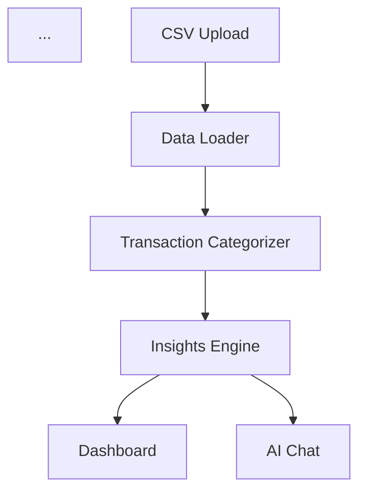
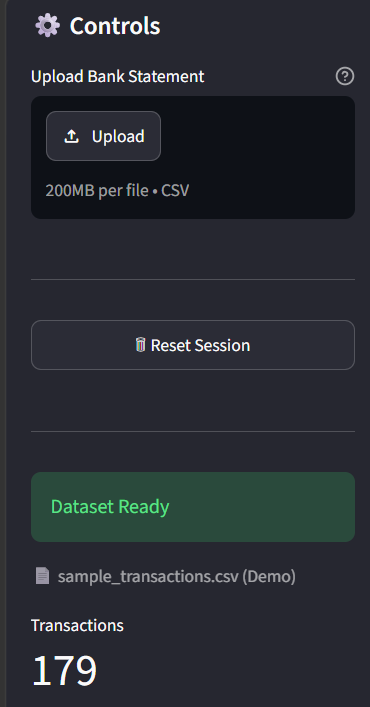
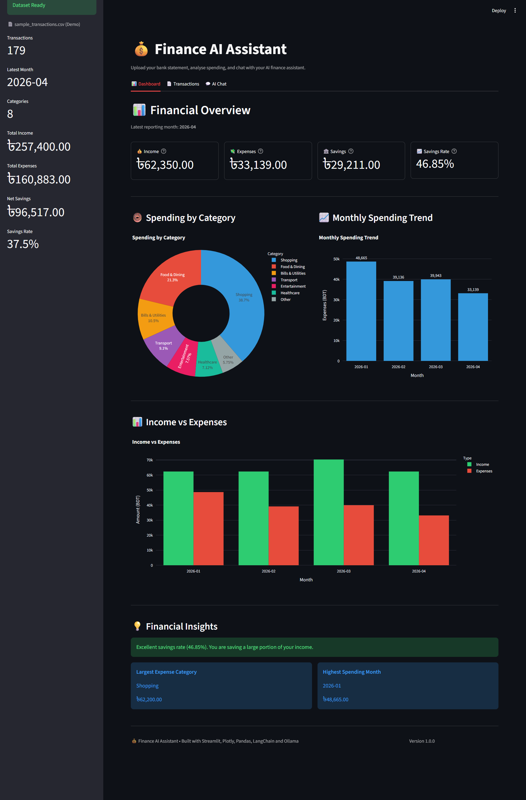
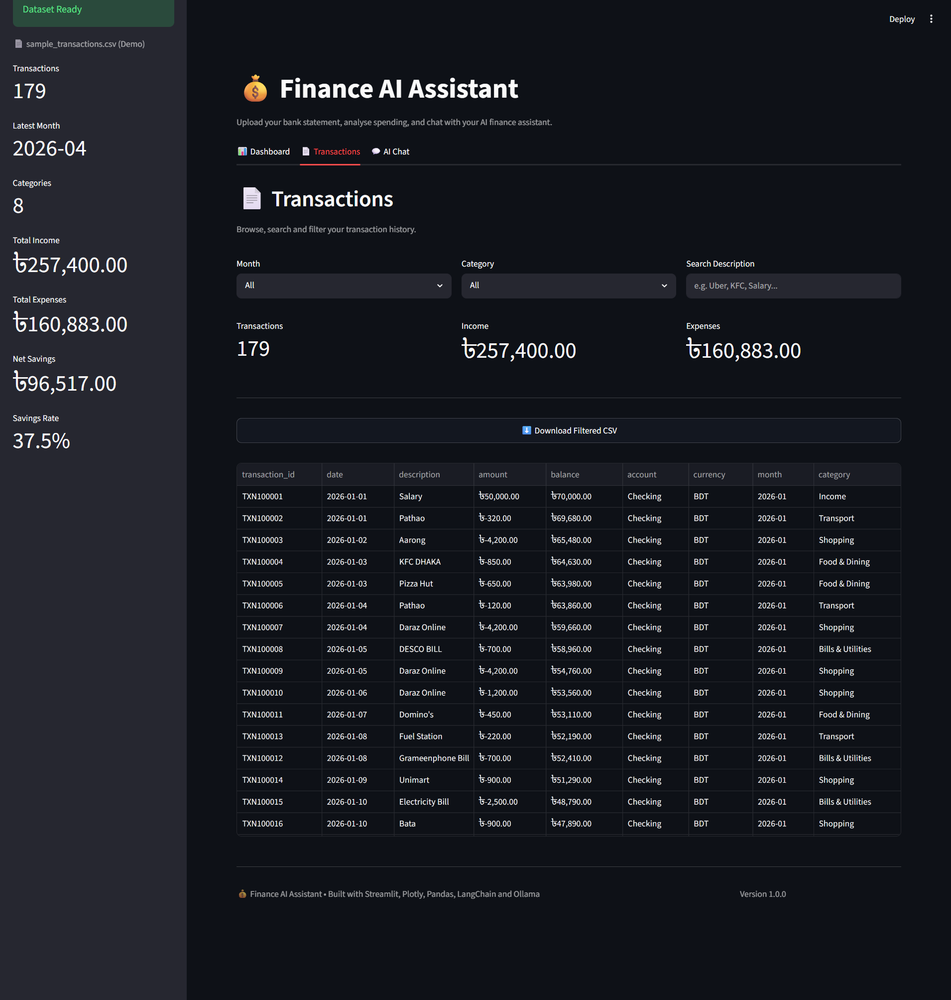
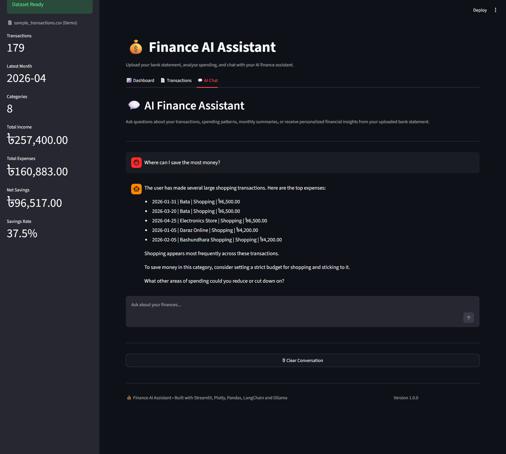

# 💰 Finance AI Assistant


An AI-powered personal finance assistant that analyzes bank statement CSV files, generates interactive financial dashboards, categorizes transactions, and answers natural-language questions about spending patterns using LangChain and Ollama.

## Project Structure

```text
finance-ai-assistant/
├── app.py
├── README.md
├── requirements.txt
├── src/
│   ├── chat.py
│   ├── insights.py
│   ├── dashboard.py
│   ├── categorizer.py
│   └── ...
├── screenshots/
└── tests/
```

## Architecture

```md

The application processes uploaded bank statements through a transaction categorization pipeline, generates financial insights, and provides both interactive dashboards and AI-powered natural language analysis.

## Features

- Upload bank statement CSV files
- Automatic transaction categorization
- Interactive financial dashboard
- Spending trend visualization
- Monthly income, expenses, and savings analysis
- AI-powered financial assistant using LangChain and Ollama
- Personalized financial insights and recommendations

## Upload Bank Statement

A sample bank statement (`sample_transactions.csv`) is included for demonstration and testing.



Upload a CSV bank statement to automatically generate financial summaries, interactive dashboards, transaction history, and AI-powered insights.

## Dashboard



## Transactions



## AI Chat



## Tech Stack


## Requirements

- Python 3.11+
- Ollama
- qwen2.5:3b model

## Installation

```bash
git clone https://github.com/TasniaNitu/finance-ai-assistant.git

cd finance-ai-assistant

pip install -r requirements.txt

streamlit run app.py
```
For AI chat functionality, install Ollama and pull the required model:

```bash
ollama pull qwen2.5:3b
```

> **Note:** The AI chat uses a local Ollama server (`qwen2.5:3b`). Dashboard and transaction analysis work normally, but the AI assistant requires Ollama to be installed and running locally.

## Performance Evaluation

The application was evaluated using a manually verified bank statement containing **179 transactions**. All financial metrics produced by the application were compared against independently calculated ground-truth values.

### Validation Results

| Metric | Manual Calculation | Application Output | Match |
|---------|------------------:|-------------------:|:-----:|
| Total Income | ৳257,400.00 | ৳257,400.00 | ✅ |
| Total Expenses | ৳160,883.00 | ৳160,883.00 | ✅ |
| Net Savings | ৳96,517.00 | ৳96,517.00 | ✅ |
| Savings Rate | 37.50% | 37.50% | ✅ |
| Largest Spending Category | Shopping | Shopping | ✅ |
| Highest Spending Month | January 2026 | January 2026 | ✅ |
| Largest Expense | ৳6,500.00 | ৳6,500.00 | ✅ |
| March vs April | April spending decreased by ৳6,804.00 | April spending decreased by ৳6,804.00 | ✅ |

**Result:** **100% (8/8 metrics matched).**

### Manual vs Automated Analysis

| Metric | Value |
|---------|------:|
| Dataset | Demo bank statement (179 transactions) |
| Metrics Evaluated | 8 |
| Manual Analysis Time | ~60 minutes |
| Application Analysis Time | 3 minutes 57 seconds (average of 2 runs on the demo dataset) |
| Accuracy | 100% |
| Time Reduction | ~15× faster than manual analysis |

The application produced identical results to the manually verified calculations while reducing the analysis time from approximately **60 minutes** to **3 minutes 57 seconds**, representing an improvement of approximately **15×** for the evaluated workflow.

## Future Improvements

- Support PDF bank statements in addition to CSV.
- Support multiple bank statement formats.
- Enable cloud deployment by replacing the local Ollama backend with a hosted LLM API.
- Add budgeting goals and monthly spending alerts.
- Export financial reports as PDF.
- Add user authentication and persistent conversation history.

## Limitations

- The AI assistant currently uses a local Ollama LLM.
- Because Ollama must run locally, the complete AI chat functionality cannot be deployed on Streamlit Cloud.
- Dashboard analytics and transaction analysis work independently of the LLM.

## License

This project is licensed under the MIT License.